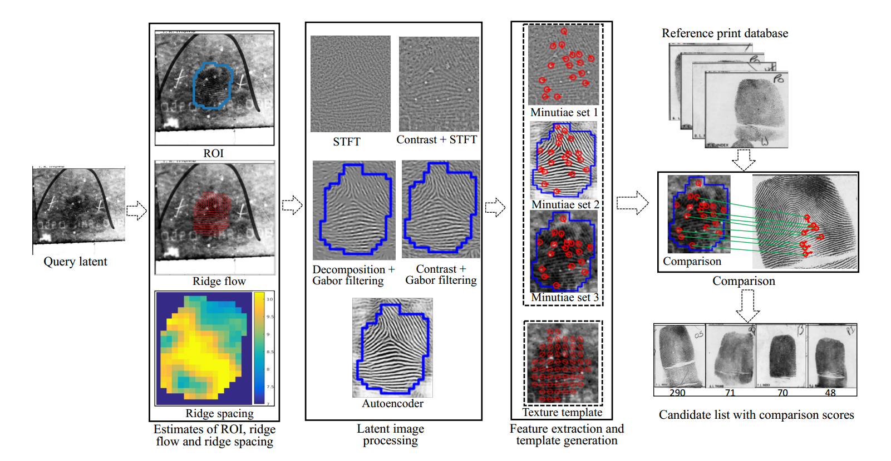

# MSU Latent Automatic Fingerprint Identification System (AFIS) 
A system for identifying latent fingerprints. 

Created at [Michigan State University](https://www.msu.edu) by [Anil K. Jain](https://www.cse.msu.edu/~jain/), [Kai Cao](https://scholar.google.com/citations?user=aA2HStQAAAAJ&hl=en), [Dinh-Luan Nguyen](https://luannd.github.io/), and [Cori Tymoszek](https://github.com/ctymoszek).
This work is sponsored by [IARPA](https://www.iarpa.gov/).



## Demo video
[](https://www.youtube.com/watch?v=YBFG9n8-07E "MSU Latent AFIS")


##  News
| Date     | Update |
|----------|--------|
| 2019-04-24 | Template extraction and Matching code |
| 2019-04-28 | Added sample latent images |

## Requirements
Feature extraction code:
Please refer to [environment.yml](environment.yml) file

Matching code:
Please install the required C++ dependencies:
- [Boost](https://www.boost.org/users/download/) (system and filesystem modules)
- [OpenMP](https://www.openmp.org)
- [Eigen](http://eigen.tuxfamily.org/index.php?title=Main_Page)

## Models
Please download the models from [Google Drive](https://drive.google.com/drive/folders/1G5NCrTPP5iSOfaPTG5J3pBH7fiTRA_Xd?usp=sharing). These models are pretrained on a forensic (not synthetic) dataset. 

Training code will be provided in the future for those who wish to train custom models.

## Data
The forensic datasets used in our experiments (including NIST SD27, MSP, etc.) are not available for public distribution. However, we have provided 3 latent fingerprint images from NIST SD27 in the /sample_data/ folder, along with their rolled mates. We have also provided the rank and similarity score computed by the system for these samples.

The latent fingerprint images in NIST SD27 are divided into three categories, "good", "bad", and "ugly", based on the quality of the fingerprint. The sample images contain one pair from each category.

## Getting Started
Place the `models` folder in the root of the repository (same level as `extraction` and `matching` folders).

Further detailed instructions for installation and use can be found in the [User Guide PDF](MSU_Latent_AFIS_User_Guide.pdf).
Short instructions:
Use this command to create the environment and install the packages:
```
conda env create -n latentafis -f environment.yml
```
After conda is finished creating the environment and installing the packages, activate the new environment:
```
conda activate latentafis
```
On some systems, you may need to use:
```
source activate latentafis
```

In the case of Tensorpack, the correct version is not available through conda. To install through pip, use these commands:
```
pip install opencv-python==3.4.2.17
pip install tensorpack==0.8.9
```

Change ``` afis.config ``` file for your custom path.

### Template Extraction
There are two scripts to do this extraction - one for the latent images (```latentafis/extraction/extraction latent.py```), and one for the rolled reference images (```latentafis/extraction/extraction rolled.py```). The general format of the usage is the same for both:
```
python scriptname.py --flag1=/path/to/a/folder/ --flag2=/path/to/another/folder/
```
Available flags for both ```extraction latent.py``` and ```extraction rolled.py``` are:

• ```--idir=/path/to/image/folder/```: This flag points to a directory where all the images inside should be processed.

• ```--tdir=/path/to/template/folder/```: This flag points to a directory where all the generated templates should be saved. Note that the software is configured to overwrite existing templates at this location in the case of name conflicts.

### Matching
The C++ code to perform matching/identification is located in ```latentafis/matching/```. First, the code must be compiled with the make command. Please ensure that the dependencies listed above are instaled. After that, the usage is as follows:
```
./match -flag /path/to/something
```
The flags available for the matcher are:

• ```-l```: This flag is analogous to the ```--i``` flag in the feature extraction scripts. It specifies the path to a single .dat file for the latent query template.

• ```-ldir```: This flag is analogous to the ```--idir``` flag in the feature extraction scripts. It specifies the path to a directory of latent .dat files for batch matching. The matcher will generate one score file for each latent in the directory.

• ```-g```: This flag specifies the path to the directory containing the templates (as .dat files) for the rolled gallery.

• ```-s```: This flag specifies the path to the directory where score files should be saved. Note that these will overwrite any existing score files at this location.

• ```-c```: This flag specifies the path to a codebook file needed by the matcher. The codebook is provided, and should be located in the same folder as the matcher. The file name should be something like ```codebook EmbeddingSize 96 stride 16 subdim 6.dat```.

## Future
- Training scripts to create custom models

## Citations:
Please cite following papers:

1. K. Cao, D. Nguyen, C. Tymoszek, A. K. Jain, ["End-to-end Latent Fingerprint Search"](https://arxiv.org/abs/1812.10213), to appear in the IEEE transactions on Information Forensics and Security, 2019.
```
@article{cao2018end,
  title={End-to-End Latent Fingerprint Search},
  author={Cao, Kai and Nguyen, Dinh-Luan and Tymoszek, Cori and Jain, AK},
  journal={arXiv preprint arXiv:1812.10213},
  year={2018}
}
```
2. D. Nguyen, K. Cao, A. K. Jain, ["Automatic Latent Fingerprint Segmentation"](https://arxiv.org/abs/1804.09650), in BTAS, 2018. 
```
@inproceedings{nguyen2018automatic,
  title={Automatic latent fingerprint segmentation},
  author={Nguyen, Dinh-Luan and Cao, Kai and Jain, Anil K},
  booktitle={IEEE International Conference on BTAS},
  year={2018}
}
```
3. K. Cao, A. K. Jain, ["Latent Fingerprint Recognition: Role of Texture Template"](https://arxiv.org/abs/1804.10337), in BTAS, 2018. 
```
@article{cao2018latent,
  title={Latent Fingerprint Recognition: Role of Texture Template},
  author={Cao, Kai and Jain, Anil K},
  journal={arXiv preprint arXiv:1804.10337},
  year={2018}
}
```
4. D. Nguyen, K.Cao, A. K. Jain, ["Robust Minutiae Extractor: Integrating Deep Networks and Fingerprint Domain Knowledge"](https://arxiv.org/pdf/1712.09401.pdf), in ICB, 2018. 

```
@inproceedings{Nguyen_MinutiaeNet,
author    = {Dinh-Luan Nguyen and Kai Cao and Anil K. Jain},
title     = {Robust Minutiae Extractor: Integrating Deep Networks and Fingerprint Domain Knowledge},
booktitle = {The 11th International Conference on Biometrics, 2018},
year      = {2018},
}
```

5. K. Cao and A. K. Jain, ["Automated Latent Fingerprint Recognition"](https://arxiv.org/abs/1704.01925), in the IEEE TPAMI, DOI 10.1109/TPAMI.2018.2818162, 2018.

```
@article{cao2019automated,
  title={Automated latent fingerprint recognition},
  author={Cao, Kai and Jain, Anil K},
  journal={IEEE transactions on pattern analysis and machine intelligence},
  volume={41},
  number={4},
  pages={788--800},
  year={2019},
  publisher={IEEE}
}
```
